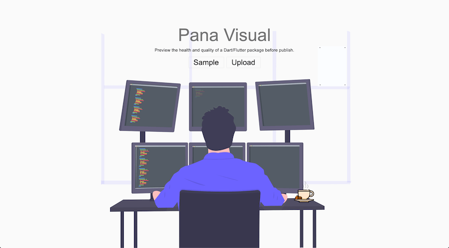
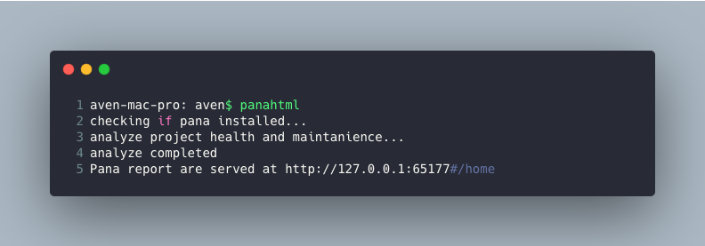
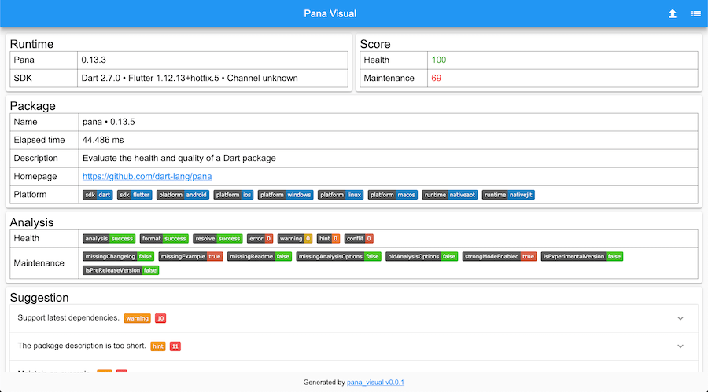

# Pana Visual
[](https://pub.dartlang.org/packages/pana_html)
[](https://github.com/hacktons/pana_visual)
[](https://codemagic.io/apps/5e4018f435303b17abf89edd/5e4018f435303b17abf89edc/latest_build)

Preview the health and quality of a Dart/Flutter package before publish.

## How to use
`Pana Visual` is designed for developer, you can use as cli directly or online;

### Command line interface

Install `pana_html` with pub.
```dart
pub global activate pana_html
``` 

After pub installation, execute `panahtml` under project root:
 


### Pana Visual Online

Use [pana](https://pub.dev/packages/pana) to evaluate your Dart/Flutter project;
```dart
pana --scores --source path $project_path >app.json
```
>You should already installed pana on local machine; If not, execute the script below: 

```dart
pub global activate pana
```

Then upload json output at [Pana Visual Online](https://pana.codemagic.app).



## License
This project is open source under [license](LICENSE).

> The flare animation is designed by [@anwar907](https://rive.app/a/anwar907) under [CC 4.0 license](https://creativecommons.org/licenses/by/4.0/)

