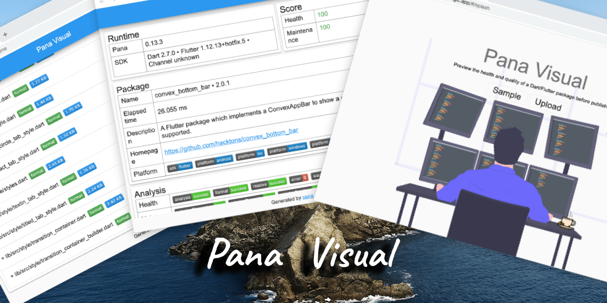

# Pana Visual

Preview the health and quality of a Dart/Flutter package before publish.



## How to use

### 0x1 Evaluate project

Use [pana](https://pub.dev/packages/pana) to evaluate your Dart/Flutter project before push to pub.dev;
```dart
pana --scores --source path $project_path >app.json
```
>You should already installed pana on local machine; If not, execute the script below: 
```dart
pub global activate pana
```

**Example**  
`pana` will evaluate the project under `./`, and redirect the output to `app.json`.

```
pana --scores --source path ./ >app.json
```

### 0x2 Upload the result 
We've host `pana visual` to [https://pana.codemagic.app](https://pana.codemagic.app)

### 0x3 Review & Fix issues
Review the report, then fix all suggestions and errors;


## License
This project is open source under [license](LICENSE).

> The flare animation is designed by [@anwar907](https://rive.app/a/anwar907) under [CC 4.0 license](https://creativecommons.org/licenses/by/4.0/)

