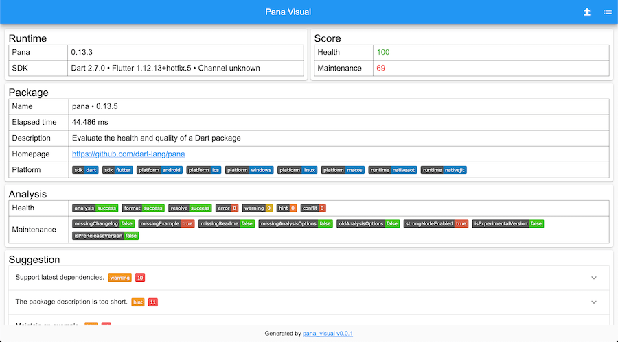

# pana_html

This cli tool is used to deploy the [pana_visual](https://github.com/hacktons/pana_visual) as local service; 

## How to use

Run the `panahtml` under your Dart/Flutter package, it will analyze the project with pana, then generate
 a html report;

